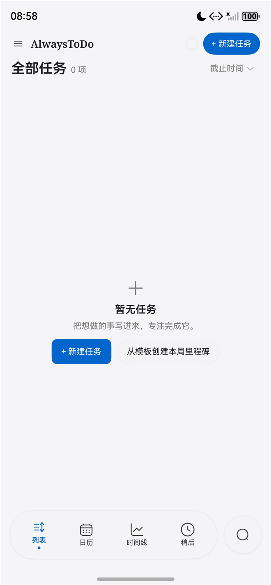
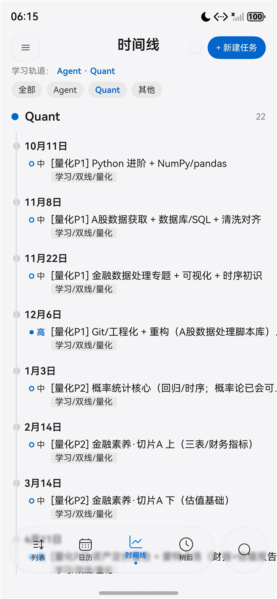
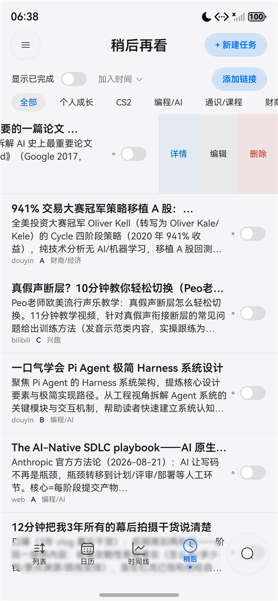
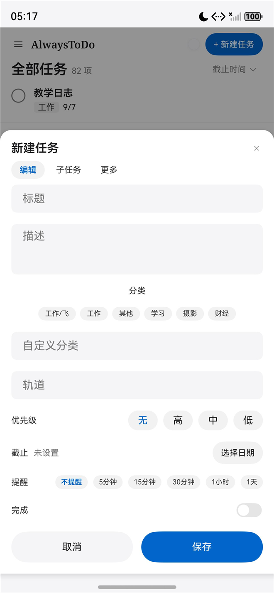

# AlwaysToDo · 鸿蒙原生待办

HarmonyOS NEXT 原生待办应用（ArkTS / ArkUI 手写，无跨端框架、无第三方运行时依赖）。
与作者自建的 Web 版 TodoSync 共用同一套同步 API，手机端为原生重写版本。

> bundle: `com.always.todosync` ｜ 目标 SDK: HarmonyOS 6.0.2 (API 22)

## 截图

| 列表 | 时间线（多轨道可切换） | 稍后再看 | 新建任务 |
|---|---|---|---|
|  |  |  |  |

## 功能

- **任务列表**：智能列表（今天 / 高优先级 / 已过期 / 各重复周期 / AI 任务 / 待确认）＋ 分类树（父分类不含子分类）＋ 三种排序（截止 / 创建 / 重要性）
- **日历**：月视图 + 周视图，今天高亮、事件胶囊、日期刻度
- **时间线**：按「轨道（track）」分泳道（如 Agent / Quant），顶部 chips 一键切换轨道；未分配轨道的任务收进可折叠的「其他任务」
- **稍后再看**：从链接收藏（服务端抓取正文并生成综述），左滑「详情 / 编辑 / 删除」，可切换来源 / 重要性 / 截止排序，支持「显示已完成」
- **搜索**：底部 dock 放大镜展开为整条搜索框，**全局检索**（不受当前智能列表 / 分类限制，含已完成）
- **任务表单**：标题 / 描述 / 分类（选项 + 自定义） / 轨道 / 优先级 / 截止（系统日期选择器） / 提醒（预设选项） / 完成；子任务、附件、循环、协作模式（AI 任务）分 tab
- **交互细节**：左滑行内操作、破坏性操作二次确认、玻璃材质（tint + blur）而非不透明浮层、展开 / 收起形变动画（`geometryTransition`）
- **系统集成**：服务卡片（今日 / 待办计数 + 前 3 条 + 快捷新建）、本地提醒、深浅双主题、系统栏配色跟随

## 构建运行

1. 用 **DevEco Studio**（HarmonyOS NEXT，SDK 6.0.2 / API 22）打开本目录
2. 首次打开需配置签名：`Project Structure → Signing Configs → 勾选 Automatically generate signature`
   （本仓库**不含任何签名材料**）
3. 修改服务地址：`entry/src/main/ets/common/ApiClient.ets` 里的 `BASE` / `BRAIN_BASE` 指向你自己的同步服务
4. 运行到模拟器 / 真机（`hdc install` 需已签名 HAP）

> 命令行构建（无需打开 IDE）：
> ```powershell
> $env:DEVECO_SDK_HOME = '<DevEco>/sdk'; $env:JAVA_HOME = '<DevEco>/jbr'
> & '<DevEco>/tools/node/node.exe' '<DevEco>/tools/hvigor/bin/hvigorw.js' `
>   --mode module -p product=default -p module=entry@default assembleHap --no-daemon
> ```

## 目录结构

```
AppScope/                     应用级配置与图标（launcher 图标真源）
entry/src/main/ets/
  common/      ApiClient / SyncEngine / Models / Storage / Reminders / Theme / SystemBars
  pages/       Index（骨架 + dock + 侧栏）/ TaskListView / CalendarView / TasksPage
               WatchlistPage / TaskEditSheet（共享任务表单）/ SettingsPage
  widget/      服务卡片 UI
  formability/ 卡片 Ability
entry/src/main/resources/base/media/   Reicon 图标集（fill 式，统一 1.5 线宽语义）
```

## 设计与实现约定

- UI 遵循工作区 **ui-standard**（视觉硬 token / 体验原则 / 搜索规范 / 文案基线），大量规则蒸馏自 Apple WWDC 设计场次
- 数据层：本地 Preferences + 待推送 outbox，`/api/sync` 全量拉取 + 墓碑合并，离线先本地生效
- 无第三方 UI 库；图标为 Reicon（MIT）白名单子集，全部 fill 式以保证 `fillColor` 生效

## License

MIT © 2026 DuFehlst
